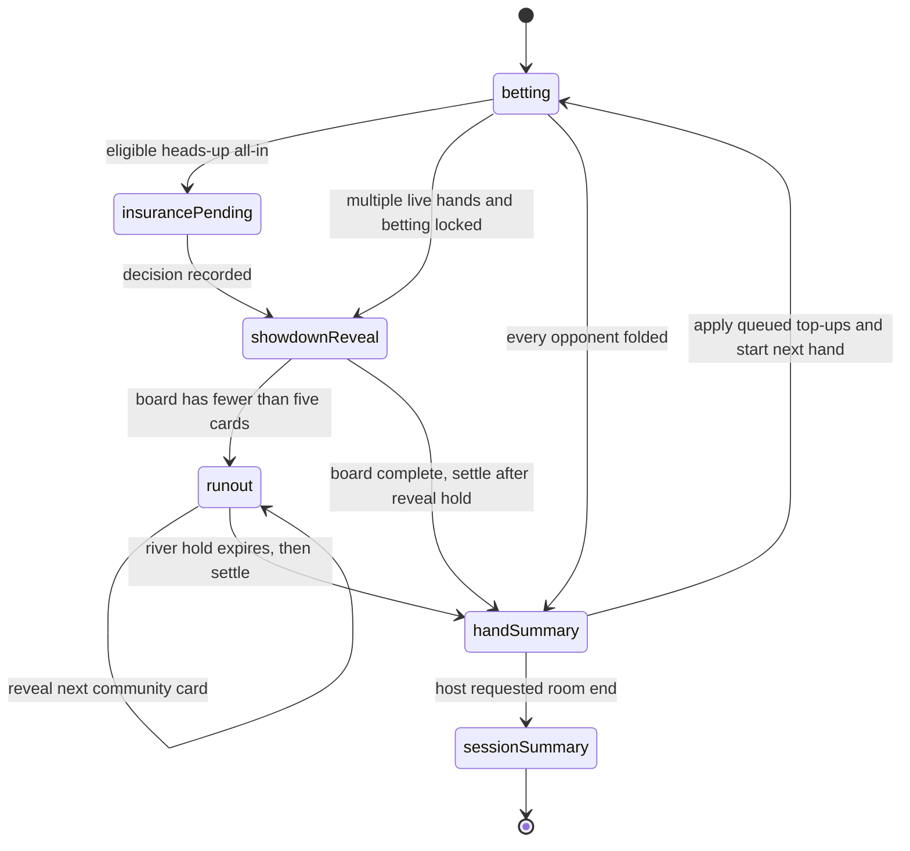

# Texas Hold'em Runout, Queued Top-Ups, and Session Statistics Design

## Status

Approved direction: the server is the single authoritative clock for showdown, all-in runout, hand settlement, queued top-ups, and room ending. Clients render the current server phase and never invent or skip dealing state locally.

This document is the source of truth for the implementation. If code, tests, or an existing protocol assumption conflicts with it, stop and update this document before coding through the ambiguity. Implementation is ready to begin only after the requirement trace, automated checks, adversarial review, and browser acceptance checks in this document are all represented in the implementation plan.

## Spec Index

| Concern | Canonical section |
| --- | --- |
| Product outcome and exclusions | Goals, Non-Goals, Users and Primary Journeys |
| Server lifecycle | Authoritative State Model, State Machine, Cinematic Timing Contract |
| Scheduling and recovery | Room Flow Controller and Scheduling, Failure Handling and Concurrency |
| Chip requests | Queued Top-Ups |
| Results and persistence | Hand Statistics, Session Statistics, Persistence and Backward Compatibility |
| Wire contract and secrecy | Protocol Additions, Error Contract, Visibility and Hidden Information |
| Browser behavior | UI Design |
| Implementation scope | Toolchain and Commands, Global Engineering Constraints, Expected File Boundaries |
| Proof of completion | Test Strategy, Conformance Matrix, Acceptance Criteria |

## Goals

1. When betting is locked by an all-in, reveal every non-folded hand, visibly deal every remaining community card at a cinematic pace, and only then determine winners.
2. Keep an add-chips control in the lower-left utility area for seated cash-table players at all times. Requests made during any hand accumulate and take effect immediately before the next hand begins. Every request and application is visible to the room.
3. After every hand, show every dealt-in player's exact chip result for two seconds.
4. Let the host end the room. If a hand is active, finish it normally and make it the final hand; then show durable room-level results.

## Non-Goals

- No money, cash-out, exchange, redemption, prize, or external-value flow.
- No public lobby, matchmaking, leaderboard, or cross-room ranking.
- No run-it-twice or configurable animation-speed controls.
- No changes to tournament rebuy rules. The persistent add-chips control is for flexible cash tables only.
- No cancellation or editing of individual queued requests. Multiple requests accumulate; a room ending before application cancels the aggregate automatically.

## Users and Primary Journeys

- **Seated cash player:** plays the current hand, may queue one or more virtual-chip additions at any time, sees the aggregate target hand, and sees exact per-hand and final results.
- **Host:** plays or observes, may declare the current hand final, and sees the same durable room summary as every other client.
- **Spectator:** cannot act or queue chips, but observes only information that is legal for the current authoritative phase.
- **Reconnect/restart client:** receives a participant-filtered snapshot after overdue phases are caught up under the room coordinator.

The primary journey is: play or all-in -> authoritative showdown/runout -> exact two-second hand summary -> apply queued top-ups -> next hand. The final journey replaces the last step with cancellation of unapplied top-ups and a durable session summary.

## Three-Tier Boundaries

| Tier | Contract |
| --- | --- |
| Always | Use test-first behavior changes; serialize state changes per room; persist a transition before broadcasting it; derive every client view through visibility filtering; use safe-integer chip arithmetic; keep the design, tests, and protocol types synchronized. |
| Ask first | Add a runtime dependency; change any confirmed duration; change top-up target/application semantics; make a breaking client protocol change; alter the database model beyond the nullable session-summary field and the deterministic buy-in identifier; expand beyond private virtual-chip rooms. |
| Never | Reveal future deck cards, folded cards, tokens, or unfiltered room state; apply queued chips during an active hand; skip the hand-summary phase; abort an active final hand; add money, cash-out, prizes, redemption, public matchmaking, or external-value behavior. |

## Confirmed Product Decisions

- All-in presentation uses the cinematic timing profile defined below.
- Hand results use layout A from the approved mockup: a central settlement card.
- The central hand-result card remains visible for exactly 2,000 ms.
- The add-chips button is persistent in the lower-left utility region.
- Add-chip requests always target the next hand and multiple requests accumulate.
- A host end request during a hand means "this is the final hand"; it never aborts or rewinds the active hand.
- Both per-hand and final room statistics are required.

## Current Behavior and Root Causes

The poker engine currently calls `runOutBoard()` and `showdown()` in one synchronous transition. The server then emits one `hand_finished` event containing the complete board and immediately calls `startNextHandIfReady()`. CSS attempts to animate an already-complete board, so users can receive the result before they perceive the missing cards being dealt.

The existing `rebuy()` operation rejects players whose stack is positive and rejects active, non-folded players. The UI only opens an add-chips modal after a stack reaches zero. The server already sends a room-wide system notice, but the chips are applied immediately rather than being queued for a hand boundary.

The existing result payload contains winners and an estimated split of the total pot. It does not contain per-player starting chips, exact per-pot awards, insurance delta, ending chips, or net result. Dividing the total pot by winner count is not correct for unequal side pots.

## Architecture Overview

The implementation is divided into five bounded units.

1. **Poker engine**: pure, deterministic rule transitions. It starts a presentation, reveals one runout card, settles exact pots, computes hand results, queues top-ups, applies eligible top-ups, and closes a room.
2. **Room flow controller**: owns phase deadlines and converts an expired phase into the next pure engine transition. It contains no WebSocket or React code.
3. **Per-room command coordinator**: serializes player messages, host messages, and timer callbacks for one room. It rejects stale timers and prevents a top-up, end request, or player action from racing a phase transition.
4. **Persistence and protocol adapters**: save authoritative room state, execute idempotent database writes, recover overdue phases, and broadcast typed snapshots/events.
5. **Table UI**: renders the authoritative phase, permanent lower-left add-chips control, central two-second hand summary, and final full-screen room summary.

The existing `RoomState.status` values remain unchanged. `status` continues to describe the room lifecycle (`lobby`, `playing`, `paused`, or `finished`); a separate flow object describes the current hand-presentation phase.

## Toolchain and Commands

The implementation uses Node.js 22, TypeScript 5.8, Next.js 15.3, React 19.1, `ws` 8.18, Zod 3.25, Prisma 6.10, PostgreSQL, Redis, Vitest 3.2, and Playwright 1.53. Do not add a new runtime dependency for scheduling, serialization, or UI state.

```bash
npm ci
npm run prisma:generate
npm test
npm run typecheck
npm run test:e2e
npm run build
LONG_RUN_SECONDS=600 ACTION_DELAY_MS=0 npm run test:long-run
docker compose -f docker-compose.prod.yml up --build -d
```

`npm test` and `npm run typecheck` are the fast checks after every coherent slice. The full unit suite, type check, Playwright suite, production build, ten-minute long-run simulation, Docker health check, desktop `1440x900` browser flow, and mobile `390x844` browser flow all block final handoff. A discovered behavior regression must first be reproduced by a failing automated test.

## Global Engineering Constraints

- Keep pure poker transitions independent of WebSocket, Redis, Prisma, React, and wall-clock globals.
- Inject the clock and timer functions into scheduling code; unit tests must not wait for real cinematic durations.
- Store deadlines as Unix epoch milliseconds and compare timer tokens before every advancement.
- Limit the WebSocket server to a 16 KiB message payload. All client message schemas remain strict.
- Allow at most 256 queued external client commands per room. Reject later client commands with `SERVER_BUSY`; deadline callbacks still enter the same serialized queue so presentation cannot deadlock under client spam.
- Validate submitted and accumulated chip amounts with `Number.isSafeInteger`; validate `requestCount` before incrementing it.
- Save the authoritative live-room snapshot before emitting a phase/card/result event. Persistence effects that must be idempotent complete before the corresponding live-state marker is cleared.
- Keep user-visible copy in private-room and virtual-chip language. Existing internal `rebuy` and `buy-in` identifiers may remain for backward compatibility.
- Commit one coherent, passing slice at a time. Do not stage `.superpowers/`, generated `.next/` output, environment files, or unrelated worktree changes.

## Authoritative State Model

The following names are the design contract for implementation.

```ts
type TableFlowPhase =
  | "betting"
  | "insurance-pending"
  | "showdown-reveal"
  | "runout"
  | "hand-summary"
  | "session-summary";

interface TableFlowState {
  phase: TableFlowPhase;
  sequence: number;
  deadlineAt: number | null; // Unix epoch milliseconds, assigned by the server
  nextRunoutStep: RunoutStep | null;
  handResult: HandResult | null;
}

interface RunoutStep {
  street: "flop" | "turn" | "river";
  cardIndexOnStreet: number;
}

interface PendingTopUp {
  participantId: string;
  targetHandNumber: number;
  amount: number;
  requestCount: number;
}

interface HandPlayerResult {
  participantId: string;
  displayName: string;
  seatNumber: number;
  startingChips: number;
  committedChips: number;
  potAward: number;
  insuranceDelta: number;
  endingChips: number;
  netChips: number;
}

interface PotAward {
  potIndex: number;
  amount: number;
  eligibleParticipantIds: string[];
  awardsByParticipantId: Record<string, number>;
}

interface HandResult {
  handNumber: number;
  board: string[];
  winnerParticipantIds: string[];
  players: HandPlayerResult[];
  pots: PotAward[];
}

interface SessionPlayerResult {
  participantId: string;
  displayName: string;
  initialChips: number;
  topUpChips: number;
  finalChips: number;
  netChips: number;
}
```

`RoomState` gains `flow`, `pendingTopUps`, `endAfterCurrentHand`, and `sessionEndedAt`. `HandState` gains `startingChipsByParticipantId` so a result does not depend on reconstructing a historical starting stack after later state changes.

The deck remains server-only. Neither future community cards nor folded/private hole cards may appear in a participant view before the relevant phase permits them.

## State Machine



Betting is considered locked for runout when the betting round is complete and fewer than two non-folded players remain able to act. This covers four-way all-ins and the case where one player with chips remains against one or more all-in players. No player may bet into an empty side pot.

Eligible existing heads-up insurance remains before showdown presentation. Accepting or declining insurance advances to the same `showdown-reveal` phase. Multiway all-ins do not receive an insurance offer.

During every phase other than `betting` or `insurance-pending`, legal actions are empty and player-action messages are rejected with `Hand presentation is in progress`.

## Cinematic Timing Contract

The server, not CSS, owns these durations:

```ts
const SHOWDOWN_REVEAL_MS = 2_000;
const FLOP_CARD_GAP_MS = 1_000;
const FLOP_HOLD_MS = 2_000;
const TURN_HOLD_MS = 2_000;
const RIVER_HOLD_MS = 2_000;
const HAND_SUMMARY_MS = 2_000;
```

For a preflop all-in:

1. Reveal every non-folded player's hole cards and wait 2 seconds.
2. Reveal flop card 1, wait 1 second.
3. Reveal flop card 2, wait 1 second.
4. Reveal flop card 3, then hold the completed flop for 2 seconds.
5. Reveal the turn and hold for 2 seconds.
6. Reveal the river and hold for 2 seconds.
7. Settle exact pots and show the hand-result card for 2 seconds.
8. Apply eligible queued top-ups and start the next hand, or enter the final room summary.

An all-in on a later street skips already-visible steps. An all-in on the river still holds the showdown reveal for 2 seconds before settlement. A fold win skips showdown/runout and enters the two-second hand summary immediately. A normal river showdown uses the two-second showdown reveal, then settlement and the two-second hand summary.

Each transition increments `flow.sequence`, saves the state, and broadcasts a new snapshot. A client animates only the newly arrived card; it never receives the rest of the board early.

## Room Flow Controller and Scheduling

`RoomFlowController` exposes deterministic transitions using an injected clock:

```ts
beginShowdown(room, now): RoomState
advanceDuePhase(room, now): RoomState
catchUpDuePhases(room, now): RoomState
isHandBoundaryDue(room, now): boolean
completeHandBoundary(room, now): RoomState
```

The game server owns one timer for each room that has a non-null `deadlineAt`. A timer callback carries a token made from `roomId`, `hand.id`, `flow.sequence`, and `deadlineAt`. Under the per-room command coordinator it reloads the newest state and advances only if the token still matches. Stale or duplicate callbacks are no-ops.

Every join and every accepted command calls `catchUpDuePhases()` under the same coordinator before processing the command. After a process restart, reconnecting clients therefore advance any overdue phases and receive the correct current state. Catch-up may cross multiple expired deadlines in one transaction but never exposes unrevealed cards from a future, non-expired step.

No global active-room Redis index is required. Rooms without connected clients may remain dormant; absolute deadlines allow the next reconnect to catch up deterministically. Connected rooms always have an in-memory timer.

## Queued Top-Ups

The existing `rebuy` client message remains for backward compatibility, but its cash-table semantics change to queueing.

### Acceptance Rules

- The room is a cash table and is not finished.
- The participant token is valid and belongs to a seated participant.
- `amount` is a positive safe integer.
- Adding `amount` to the participant's existing pending amount must remain a safe integer.
- The client cannot provide a target hand number.

The target is always `room.handCounter + 1`. Requests accepted before the serialized next-hand transition target that next hand; requests that arrive after it target the following hand. Multiple requests for the same participant and target hand add to one `PendingTopUp` aggregate.

Submitting a request does not change `Seat.chips` or `Seat.cumulativeBuyIn`. The room broadcasts a typed `top_up_queued` event and a visible system message such as:

> Lin queued 500 chips for hand 19; 800 chips pending in total.

Immediately before a hand starts, the engine simulates the queued additions to determine whether at least two eligible active seats will exist. If not, requests remain pending. If a hand can start, all pending entries targeting that hand are applied in the same serialized transition, `cumulativeBuyIn` is incremented, and `top_up_applied` events are broadcast before `hand_started`.

When the two-second hand summary expires but fewer than two players can start even after simulated queued additions, `completeHandBoundary()` returns to `flow.phase = "betting"` with `deadlineAt = null`, keeps the previous hand marked finished, clears the transient `flow.handResult`, and leaves queued additions unchanged. This is the waiting-between-hands form of `betting`, so the result card does not remain indefinitely. A later accepted top-up reruns the same readiness check; if it makes a hand possible, persistence, application, and `startHand()` occur in that serialized command.

Each aggregate uses a deterministic database record ID derived from `(roomId, participantId, targetHandNumber)`. `RoomRepository` upserts this record, so retrying after a crash cannot create duplicate buy-in rows. Database upserts complete before the room snapshot clears the pending entries. A retry after a partial failure repeats the same upsert safely.

If the room enters `session-summary`, all pending entries are cleared without changing chips or cumulative buy-in. A room-wide cancellation notice identifies each cancelled aggregate. New requests after room finish are rejected.

## Host Room Ending

The already-defined `end_room` client message becomes functional and continues to require a valid host token.

- With an active, unfinished hand, it sets `endAfterCurrentHand = true` and broadcasts `room_end_requested`. The host control becomes disabled and reads `Ending after this hand`.
- During `hand-summary`, the same command sets the flag before the summary deadline.
- With no active hand, it enters `session-summary` immediately.
- Repeated valid requests are idempotent.
- Player actions cannot cancel the request.

When the final hand's two-second summary expires, the server cancels unapplied top-ups, computes the session result, persists it, sets `RoomState.status = "finished"`, sets `sessionEndedAt`, and broadcasts `room_finished`.

## Hand Statistics

Every dealt-in player appears in `HandResult.players`, including folded players and players who finish with zero chips. The result is sorted for presentation by `netChips` descending and then by seat number.

The accounting equations are:

```text
endingChips = startingChips - committedChips + potAward + insuranceDelta
netChips = endingChips - startingChips
```

`potAward` is the sum of that participant's exact awards across main and side pots. Remainder chips use the existing deterministic seat-order rule. `insuranceDelta` is positive for coverage received, negative for premium paid, and zero otherwise. Consequently, non-insurance hands sum to zero net chips; insurance hands may have a non-zero player sum representing the virtual house-side insurance adjustment.

Settlement returns `PotAward[]` directly. Hand persistence uses those exact awards instead of filtering a global winner list, preventing a player who won one side pot from being incorrectly recorded as a winner of another pot.

The existing `HandPlayer.startingChips` and `HandPlayer.endingChips` columns persist the result without a schema change. The hand review query is extended to return `netChips`, allowing the last result to remain inspectable after the live two-second card disappears.

## Session Statistics

For every participant who was dealt into at least one hand or still occupies a seat at room end:

```text
initialChips = room.settings.initialChips
topUpChips = cumulativeBuyIn - initialChips
finalChips = final authoritative seat stack
netChips = finalChips - initialChips - topUpChips
```

Only applied top-ups are included. Pending aggregates are excluded and cancelled at room end.

The final summary is stored in a new nullable `Room.sessionSummary Json` field together with the existing `Room.endedAt`. This makes the result durable beyond the live-room Redis TTL without adding a query-heavy analytics model. The JSON payload is validated by a shared schema when written and read. Repeating finalization updates the same room row and produces the same payload.

## Protocol Additions

Client messages:

- `rebuy`: retained; now queues a top-up.
- `end_room`: retained; now implemented.

Server events added:

- `showdown_started`: hand number, phase sequence, revealed participant IDs, deadline.
- `runout_card_revealed`: hand number, phase sequence, street, card index, serialized card, deadline.
- `top_up_queued`: participant, submitted amount, pending total, target hand number.
- `top_up_applied`: participant, applied amount, hand number.
- `room_end_requested`: final hand number when known.
- `room_finished`: durable `SessionPlayerResult[]`.

`room_snapshot` remains authoritative. Events drive transient animation and notices, while reconnecting clients can reconstruct the current screen from the snapshot alone. Additive fields preserve compatibility with a browser that loaded the previous client bundle; it may omit new presentation but cannot send an illegal action because the server rejects it.

## Error Contract

The additive error payload is `{ code: RealtimeErrorCode; message: string }`. Existing clients may continue reading only `message`. New or changed paths use these canonical codes:

```ts
type RealtimeErrorCode =
  | "INVALID_MESSAGE"
  | "ROOM_NOT_FOUND"
  | "INVALID_PARTICIPANT_TOKEN"
  | "INVALID_HOST_TOKEN"
  | "PRESENTATION_IN_PROGRESS"
  | "TOP_UP_NOT_ALLOWED"
  | "TOP_UP_AMOUNT_INVALID"
  | "ROOM_FINISHED"
  | "SERVER_BUSY";
```

Every rejection leaves live state and durable state unchanged. Presentation actions use `PRESENTATION_IN_PROGRESS`; tournament, spectator, or otherwise ineligible chip requests use `TOP_UP_NOT_ALLOWED`; unsafe or overflowing chip arithmetic uses `TOP_UP_AMOUNT_INVALID`; and a bounded coordinator that cannot accept more work uses `SERVER_BUSY`. Authentication failures never identify which token field or database record matched.

## Visibility and Hidden Information

- Before `showdown-reveal`, each player sees only their own hole cards; spectators see none.
- At `showdown-reveal`, all clients in the private room may see hole cards only for non-folded players still contesting a pot.
- Folded cards remain hidden.
- Future runout cards remain only in the server-side deck until their transition.
- Winner IDs, pot awards, hand results, and the collect-pot animation do not appear before settlement.
- A forged participant token is rejected before any private snapshot is produced.

## UI Design

### Lower-Left Add-Chips Control

- Replace the forced stack-empty modal with a persistent lower-left `Add chips` button for seated cash players.
- The button remains visible during betting, insurance, showdown, runout, and hand summary.
- Clicking opens a small anchored popover with a positive integer input and `Add next hand` action.
- After acceptance, the button displays `Pending +800` and the popover names the target hand.
- The control is disabled while disconnected and hidden for spectators, unseated visitors, tournaments, and finished rooms.
- Room-wide queue/application/cancellation events use the existing table toast surface.

### Central Hand Result Card

- Appears only in `hand-summary`.
- Shows hand number, board, all dealt-in players, and signed net chips.
- Highlights exact pot winners but does not label a player as an overall winner merely because they received a side-pot award while losing net chips.
- Uses a compact two-column list when more than five players participated.
- Holds for exactly 2 seconds. The same result remains available on the hand review page.

### Host Control and Final Summary

- Host tools include `End room`.
- During an active final hand the button reads `Ending after this hand` and is disabled.
- A small table notice tells every client that the current hand is final.
- `session-summary` displays a non-expiring full-screen result table with initial chips, applied top-ups, final chips, and signed total net chips, sorted by total net chips descending.
- No next-hand controls or betting actions are shown after room finish.

## Persistence and Backward Compatibility

- `LiveRoomStore` schemas gain `flow`, `pendingTopUps`, `endAfterCurrentHand`, `sessionEndedAt`, and `startingChipsByParticipantId`.
- Loading an older live room defaults missing room fields to an empty pending map, `false`, and a derived flow: active unfinished hand becomes `betting`; no hand becomes `betting`; a finished hand becomes an expired `hand-summary` ready for catch-up.
- The normalization happens after schema parsing and before rule validation, so a rolling deployment does not discard an otherwise valid live room.
- `Room.sessionSummary` requires one Prisma migration.
- Hand and buy-in writes remain idempotent. Room finalization updates the existing room row.
- The 24-hour Redis TTL remains unchanged; final hand and session statistics survive in PostgreSQL.

## Failure Handling and Concurrency

- All commands and deadline callbacks for one room pass through a per-room promise queue.
- A stale timer token, duplicate callback, repeated end request, repeated hand persistence call, or repeated top-up application is a no-op or idempotent upsert.
- If top-up persistence fails, chips are not applied and the next hand does not start. The overdue transition retries and clients see a reconnecting/temporarily unavailable notice rather than unrecorded chips.
- If final session persistence fails, the room remains in its final hand summary with `endAfterCurrentHand = true`; it does not falsely announce a finished room.
- If a runout transition save fails, the next card is not broadcast. Retrying uses the same server deck and phase token, preventing skipped or double-dealt cards.
- Disconnecting does not alter deadlines. Rejoining receives the current phase after catch-up.
- A top-up submitted at the exact next-hand deadline is ordered by the room queue: if accepted first it targets the imminent hand; if the hand transition wins it targets the following hand. The response always states the target hand.
- All chip amounts and additions use safe-integer validation; negative, zero, fractional, overflowing, forged, tournament, unseated, or post-finish requests are rejected.

## Expected File Boundaries

- `src/lib/poker/engine.ts`: pure phase, runout, top-up, finalization, and exact award transitions.
- `src/lib/poker/types.ts`: flow, result, pending-top-up, and award types.
- `src/lib/poker/visibility.ts`: phase-aware hole-card and result projection.
- `src/lib/realtime/messages.ts`: additive typed protocol events and functional `end_room` contract.
- `src/server/room-flow-controller.ts`: deadline scheduling/catch-up logic with an injected clock.
- `src/server/room-command-coordinator.ts`: per-room serialization and stale-token protection.
- `src/server/realtime/game-server.ts`: command routing, effect execution, save, broadcast, and timer registration.
- `src/server/live-room-store.ts`: backward-compatible state parsing.
- `src/server/repositories/room-repository.ts`: exact pot persistence, deterministic top-up upsert, room finalization, and review statistics.
- `prisma/schema.prisma` plus one migration: nullable `Room.sessionSummary`.
- `src/components/table/ActionControls.tsx`: permanent lower-left add-chips popover and host end control.
- `src/components/table/HandResultPanel.tsx`: central per-hand result card.
- `src/components/table/SessionResultPanel.tsx`: final full-screen result table.
- `src/app/room/[roomId]/RoomClient.tsx`: new event routing without client-owned phase timers.
- `src/styles/globals.css`: approved layout A, pending badge, and responsive result tables.

## Test Strategy

### Poker Engine

- Four players all-in preflop enter `showdown-reveal` without a winner or board cards.
- Runout transitions reveal board lengths `0 -> 1 -> 2 -> 3 -> 4 -> 5` and do not settle before the river hold expires.
- All-in on flop, turn, and river skips only already-completed steps.
- Main pots, multiple side pots, split pots, and remainder chips produce exact `PotAward[]` and per-player net results.
- Fold wins and normal river showdowns produce complete results for every dealt-in player.
- Accepted insurance produces the correct `insuranceDelta` without changing pot awards.
- Multiple top-ups accumulate, do not alter the current hand, and apply only at the target hand boundary.
- Pending top-ups remain queued when fewer than two eligible players can start and are cancelled when the room ends.
- Session totals exclude pending top-ups and satisfy the documented formulas.

### Flow Controller and Persistence

- A fake clock proves every exact deadline and event order in the cinematic profile.
- Duplicate and stale timer tokens do not advance a room.
- Catch-up after a simulated restart advances only expired steps and reveals no future card.
- Concurrent top-up, end-room, action, and timer operations serialize deterministically.
- Old live-room JSON loads with safe defaults.
- Deterministic top-up upserts do not duplicate buy-in rows after a simulated partial failure.
- Room finalization persists one validated session summary and one `endedAt` value idempotently.

### Realtime

- Four authenticated players and a spectator observe the same phase sequence and board at every step.
- No client receives a future board card, result, or folded hole cards early.
- All clients receive queue, application, cancellation, final-hand, hand-result, and room-result events.
- Player actions are rejected during presentation phases.
- Forged participant and host tokens cannot queue chips or end a room.
- Reconnecting during each phase receives a renderable authoritative snapshot.

### UI and End-to-End

- The lower-left add-chips button is present for a seated cash player at positive and zero stack during all hand phases.
- Accepted requests show the pending aggregate and target hand.
- The central result card contains every participant and remains tied to `hand-summary`, not a client timeout.
- More than five participants use the compact two-column layout without overlap.
- The host end control changes state and the full-screen session summary blocks subsequent play.
- A four-player browser flow proves visible hole-card reveal, each remaining board card, exact result ordering, two-second summary, and next-hand transition.
- Desktop `1440x900` and mobile `390x844` layouts preserve the lower-left utility, hero area, and action console without overlap.
- The long-run simulation verifies chip conservation adjusted for recorded insurance delta and applied top-ups.

## Conformance Matrix

| Case | Setup | Action | Required result |
| --- | --- | --- | --- |
| Four-way preflop all-in | Four live players, incomplete board | Last legal action locks betting | Phase becomes `showdown-reveal`; no board card, pot award, or winner is exposed. |
| Stale runout timer | Current sequence is newer than callback token | Invoke callback | No state, persistence, or broadcast changes. |
| Restart mid-flop | Flop card 1 deadline expired; card 2 deadline is future | Join room | Catch-up reveals only due cards and schedules the future absolute deadline. |
| Top-up during betting | Seated cash player has positive stack | Submit 500, then 300 | Current stack is unchanged; pending total is 800 for the next hand; both requests notify the room. |
| Top-up/application race | A request and hand-summary deadline enter the room queue | Execute both orders | Request targets imminent hand only if serialized first; response/event states the chosen target. |
| Host ends during hand | Active hand is unfinished | Valid host sends `end_room` twice | One idempotent final-hand flag/event; hand completes; no following hand starts. |
| Unauthorized end | Non-host token | Send `end_room` | `INVALID_HOST_TOKEN`; room state is byte-for-byte unchanged. |
| Spectator top-up | Joined but unseated client | Send `rebuy` | `TOP_UP_NOT_ALLOWED`; no pending entry or notice. |
| Side-pot result | Unequal all-ins create main and side pots | Settle river | Each `PotAward` names its own eligible players and awards; every dealt-in player's signed net is exact. |
| Finalization failure | Final hand summary expires and room write fails | Advance deadline | Remain in final hand summary; do not emit `room_finished`; retry is safe. |
| Hidden-information probe | Client reconnects before a future runout step | Request snapshot | No future board card, folded card, server deck, or token is serialized. |

## Acceptance Criteria

1. A four-way preflop all-in visibly shows all four live hands, then all five community cards in the documented order and timing, before any result is visible.
2. Every connected client observes the same phase, board, and result; refresh/reconnect resumes the authoritative current phase.
3. A seated cash player can queue chips from the permanent lower-left control at any time, including with a positive stack and during an active hand.
4. Two requests of 500 and 300 show a pending total of 800, notify the room, leave the active hand unchanged, and add exactly 800 immediately before the next eligible hand.
5. Every hand result lists all dealt-in players and exact signed net chips, including correct unequal side-pot awards.
6. The central hand-result card is visible for exactly 2 seconds before the next transition.
7. A host end request never interrupts an active hand, prevents a following hand, cancels unapplied top-ups, persists `endedAt` and the final summary, and shows every participant's initial chips, top-ups, final chips, and total net chips.
8. Tournament behavior, insurance eligibility, hidden-card security, hand history, and private-room/virtual-chip product boundaries remain intact.

## Decision Log

| Date | Decision | Reason |
| --- | --- | --- |
| 2026-07-17 | Use a server-authoritative presentation state machine with absolute deadlines. | All clients must observe the same cinematic sequence and recover after reconnect/restart. |
| 2026-07-17 | Queue and accumulate chip requests for the next hand. | The active hand must remain unchanged while players may request chips at any time. |
| 2026-07-17 | Show a central per-hand card for exactly two seconds and a persistent final summary. | Matches the approved layout A and separates transient hand feedback from room totals. |
| 2026-07-17 | Store the final room summary as nullable validated JSON. | Preserves results beyond Redis TTL without adding a query-heavy analytics model. |
| 2026-07-17 | Reuse the existing `rebuy` and `end_room` client message names additively. | Avoids a breaking protocol migration while changing cash-table semantics safely. |
| 2026-07-17 | Reuse deadline-free `betting` as the waiting-between-hands phase when fewer than two players can start. | Preserves the approved phase contract, removes the transient result after two seconds, and lets a later queued top-up start the next hand without inventing an extra lifecycle state. |

There are no open product questions for implementation. Any newly discovered ambiguity, protocol mismatch, or persistence invariant must be recorded in this log and resolved in the spec before implementation continues.

## Spec Maintenance and Review Gates

- The design file, implementation plan, shared types, and conformance tests must use the same phase, event, error-code, and field names.
- Update this design first when an implementation discovery changes a contract; include the design and test adjustment in the same coherent commit.
- Before each commit, run the focused red/green test plus `npm run typecheck` when public types changed.
- Before final handoff, run every command and manual browser check listed under Toolchain and Commands, then perform the adversarial hidden-information/auth/concurrency review.
- Critical or important review findings block completion. Known environmental blockers must be reported with the exact failed command and must not be represented as a passing check.
